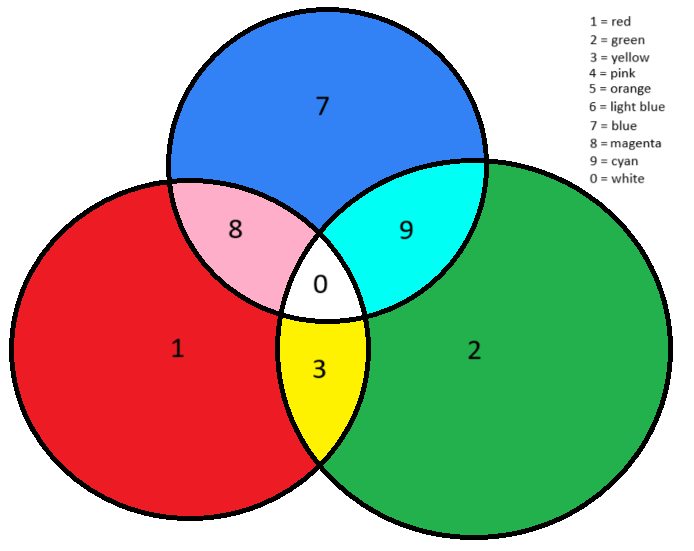

# Image Compression

## Description
This repository contains a project focused on **image compression**. The primary goal of this project is to explore methods for reducing the size of image files while preserving their visual quality as much as possible.
This project was inspired by a want to reduce image file size with a simple technique. This project will then move to use more advanced techniques to recover more information and reduce overall loss. 
The goal of the simple compression is maximize speed and compression while the more advanced will be focused more on decreasing data loss and compression. Speed up methods will then be tested on both versions.
This program's simple version is based on the idea that a color image has at least three values that represent how much red, green and blue
is present inside a given pixel. For a simple compression, we will take those three values and convert them to one. After this point the value will indicate how bright a pixel is. This should theoretically take any file and reduce the size by 66% because we are removing **2 out of the 3** of the values. This functions as a great method for file reduction but the file also loses a significant amount of data.
In order to recover some of that lost data, I decided to use the ones place to encode information about the cells color. For example if the reduced value for the black and white image is 234, I remove the current value inside the ones place turning the number to 230. The next step is analyzing the pixel that is being converted and see which colors stand out the most. For this simple model I have values 0-9 to encode color data. Realistically you get about 6 unique values that you can encode due to the use of 4 being white, red, green and blue.
To create unique color combinations for each color, I encoded 1 as red, 2 as green, and 7 as blue. 1, 2, and 7 are important because these number additions are unique. The diagram below shows how these colors were encoded. This color diagram details which colors are encoded to what value, and extra layers of color are added to later levels to augment the type of a certain color.


 - The above image showcases the principles of the coloration.

## Compression Information
For this section we will run through the files provided and the image compression as well as the time for each image.
| File Name               | Size before Compression(SBC)  | Size After Compression(SAC) | Size After reconversion | Loss of Data % | SAC / SBC % |
|-------------------------|-------------------------------|-----------------------------|-------------------------|----------------|-------------|
| file.PNG                |      4,544 bytes              |       2,142 bytes           |       3,701 bytes       |    18.5519 %   |   47.139 %  |
| file1.PNG               |      4,524 bytes              |       2,128 bytes           |       3,675 bytes       |    18.7666 %   |   47.038 %  |
| file2.PNG               |      4,525 bytes              |       2,129 bytes           |       3,677 bytes       |    18.7403 %   |   47.050 %  |
| file3.PNG               |      4,544 bytes              |       2,142 bytes           |       3,702 bytes       |    18.5299 %   |   47.139 %  |
| file4.PNG               |      4,549 bytes              |       2,142 bytes           |       3,699 bytes       |    18.6854 %   |   47.087 %  |
| file5.PNG               |      4,544 bytes              |       2,142 bytes           |       3,700 bytes       |    18.5739 %   |   47.139 %  |
| file6.PNG               |      4,554 bytes              |       2,141 bytes           |       3,704 bytes       |    18.6649 %   |   47.014 %  |
| file7.PNG               |      4,553 bytes              |       2,142 bytes           |       3,700 bytes       |    18.7349 %   |   47.046 %  |
| file8.PNG               |      4,555 bytes              |       2,142 bytes           |       3,708 bytes       |    18.5950 %   |   47.025 %  |
| art.PNG                 |      549,584 bytes            |       72,323 bytes          |       127,556 bytes     |    76.7904 %   |   13.160 %  |
| art1.PNG                |      463,613 bytes            |       68,240 bytes          |       114,610 bytes     |    75.2790 %   |   14.719 %  |

## Image Example:


 - **Image Before Any changes**


 - **Image Converted to Black & White**


 - **Image After color is added back to image**
 - **Even though loss of data is at 75.7904% the image appears roughly the same!**

Included in the repository are:
- A collection of sample images for testing and experimentation.
- Two PowerShell scripts to facilitate running and cleaning up the program.

This project is entirely my own work and reflects my understanding and implementation of image compression techniques.

## Scripts

### `run_tests.ps1`
This script executes the program using all sample images provided in the repository. It is designed to streamline the testing process, allowing you to see the compression results across various input files with a single command.

### `remove.ps1`
This script removes all files generated by the program. It identifies and deletes these files based on their file name extensions, which are added by the compression process and reconversion process.

## Repository Structure
```
Image-Compression/
├── sample_images/         # Directory containing sample images
├── run_tests.ps1          # Script to run the program on all sample images
├── remove.ps1             # Script to clean up generated files
├── art.PNG                # Sample art for local testing
├── art1.PNG               # Sample art for local testing
├── color_diagram.PNG      # Diagram to show off color palette
├── file.PNG               # Sample color for Red
├── file1.PNG              # Sample color for Green
├── file2.PNG              # Sample color for Blue
├── file3.PNG              # Sample color for Yellow
├── file4.PNG              # Sample color for Magenta
├── file5.PNG              # Sample color for Cyan
├── file6.PNG              # Sample color for Orange
├── file7.PNG              # Sample color for Pink
├── file8.PNG              # Sample color for light Blues
└── README.md              # Project documentation (this file)

```

## Usage

**Run Tests**:
   Use the `run_tests.ps1` script to compress all sample images:
   ```powershell
   ./run_tests.ps1
   ```

**Clean Up**:
   Use the `remove.ps1` script to remove all files generated during the tests:
   ```powershell
   ./remove.ps1
   ```
**Any Added Images**:
   Use the `img_convert` script to convert and reconvert a given image:
   ```powershell
   python img_convert.py
   ```

## Acknowledgments
This project is a personal endeavor and showcases my work in understanding and applying image compression techniques.

